# 🚀 MahaStartup: Full-Stack Production Architecture & Advanced AI Approaches
> **Roadmap & Deep Technical Blueprint** | SIH 2026 Problem Statement ID: `26136`  
> **Topic**: Production AI Infrastructure & Advanced AI Approaches Beyond Simple Semantic Matching

---

## 🏛️ PART 1: Full-Stack Production System Architecture

Currently, the project provides an interactive **Frontend & Application Prototype** with a complete domain model. Below is the exact architecture to transition this into a **fully working, scalable, production-grade cloud system** using Python/FastAPI microservices, specialized AI pipelines, vector/graph databases, and external government APIs.

```mermaid
flowchart TB
    %% STYLES
    classDef client fill:#EBF5FF,stroke:#2563EB,stroke-width:2px,color:#1E3A8A;
    classDef gateway fill:#F3F4F6,stroke:#4B5563,stroke-width:2px,color:#111827;
    classDef aiEngines fill:#EEF2FF,stroke:#4F46E5,stroke-width:2px,color:#312E81;
    classDef queue fill:#ECFDF5,stroke:#059669,stroke-width:2px,color:#064E3B;
    classDef storage fill:#FEF3C7,stroke:#D97706,stroke-width:2px,color:#78350F;
    classDef external fill:#FDF2F8,stroke:#DB2777,stroke-width:2px,color:#831843;

    %% 1. PRESENTATION LAYER
    subgraph L1["1. FRONTEND USER INTERFACE (React 18 + Vite + TypeScript)"]
        OfficerPortal["🏛️ Government Officer Command Center\n(Challenge Builder, Expert Scoring, Pilot Management, Scale Sanction)"]:::client
        StartupPortal["🚀 Startup Innovator Portal\n(Open Tenders, 1-Click DPIIT Bidding, Escrow Claims)"]:::client
    end

    %% 2. API & GATEWAY LAYER
    subgraph L2["2. API GATEWAY & SECURITY LAYER (FastAPI / NGINX)"]
        APIGateway["🛡️ API Gateway & Rate Limiter (OAuth2 / JWT / TLS 1.3)"]:::gateway
        RBAC["🔐 Role-Based Access Controller (IAS Approver | Evaluator | Startup)"]:::gateway
    end

    %% 3. ASYNC TASK QUEUE & WORKERS
    subgraph L3["3. ASYNCHRONOUS TASK ORCHESTRATION (Celery + Redis / RabbitMQ)"]
        TaskBroker["⚡ Redis Task Broker / Event Stream"]:::queue
        Workers["⚙️ Distributed AI Background Workers\n(Batch Matching, Graph Indexing, Document Verification)"]:::queue
    end

    %% 4. AI & INTELLIGENCE MICROSERVICES
    subgraph L4["4. SPECIALIZED AI & ANALYTICS PIPELINES (Python / LangChain / Gemini)"]
        NLPStructuring["📝 Tender Formulation Engine\n(LLM JSON extraction for GFR 194 baseline KPIs)"]:::aiEngines
        GraphMatcher["🧠 Graph RAG & Knowledge Matcher\n(Tech taxonomy alignment & semantic graph traversal)"]:::aiEngines
        MultiAgentPanel["👥 Multi-Agent Evaluator Committee\n(Autonomous Technical, Financial & Legal reviewer agents)"]:::aiEngines
        RiskEngine["⚠️ Predictive Risk & Failure Classifier\n(ML scope creep & milestone delay prediction)"]:::aiEngines
        DocVerifier["📄 Document & Evidence OCR Verifier\n(Multimodal invoice & test report verification)"]:::aiEngines
    end

    %% 5. DATA & STORAGE LAYER
    subgraph L5["5. DATABASE & STORAGE LAYER (MeitY Empanelled Cloud)"]
        Postgres[(🗄️ PostgreSQL Master DB\nUsers, Tenders, Contracts, Scores)]:::storage
        VectorDB[(🔍 Qdrant / pgvector\nStartup & Challenge Embeddings)]:::storage
        GraphDB[(🕸️ Neo4j Knowledge Graph\nTech Taxonomy & Concept Nodes)]:::storage
        DocVault[(📁 Encrypted S3 Document Vault\nSigned Sanctions, Audit Certs)]:::storage
        AuditLedger[(🔒 SHA-256 Audit Trail\nImmutable CVC/CAG State Chain)]:::storage
    end

    %% 6. EXTERNAL GOVT SERVICES
    subgraph L6["6. EXTERNAL GOVERNMENT INTEGRATIONS"]
        DPIIT_API["🇮🇳 DPIIT Startup India API (Entity & 80-IAC Sync)"]:::external
        GeM_API["🛍️ GeM / MahaGEMS API v4.2 (Catalog Onboarding)"]:::external
        Aadhaar_eSign["✍️ Digital Signature (DSC / Aadhaar eSign)"]:::external
    end

    %% FLOW CONNECTIONS
    L1 --> L2
    L2 --> L3
    L2 --> L4
    L3 --> L4
    L4 --> L5
    L4 <--> L6
```

---

## 🤖 PART 2: Advanced AI Approaches (Beyond Basic Semantic Matching)

Simple semantic matching (calculating cosine similarity between text embeddings) has serious limitations in government procurement:
- It matches **keywords and marketing prose** rather than true algorithmic and technical capability.
- It fails to understand **hierarchical technical prerequisites** (e.g. knowing that *Capacitated VRP* is a specialized solution for *Fleet Fuel Optimization*).
- It provides **zero explanations** to public officers who face vigilance audits.

Here are the **6 Advanced AI Approaches** that elevate MahaStartup into an enterprise-grade procurement intelligence system:

---

### 1. 🕸️ Knowledge Graph & Graph RAG Alignment (Concept Hierarchy Matching)
- **The Concept**: Instead of flat text embeddings, we construct a **Public Sector Technology Knowledge Graph** in Neo4j.
  - *Challenge Node*: `Pune Municipal Waste` $\rightarrow$ `Sub-problem: Morning Fuel Idle Time` $\rightarrow$ `Required Solution: Dynamic Graph VRP`.
  - *Startup Node*: `RouteAI Tech` $\rightarrow$ `Capability: Capacitated Graph Neural VRP` $\rightarrow$ `Deployed: Nagpur Fleet`.
- **How it Works**: Uses **Graph Convolutional Networks (GCN)** and **Sub-graph Isomorphism** to measure how well the startup's architectural graph overlaps with the government's problem topology.
- **Advantage**: Matches deep-tech solutions even if the startup describes their tech in academic/patented terms that don't match the municipal officer's everyday vocabulary.

---

### 2. 👥 Multi-Agent AI Advisory Committee (Agentic Procurement AI)
- **The Concept**: Deploy autonomous, role-specific LLM Agents acting as pre-evaluation expert advisors before human committee meetings:
  1. **Technical Architecture Agent**: Evaluates algorithm time complexity ($O(N \log N)$ vs $O(N^2)$), edge resilience, and API maintainability.
  2. **Financial & RoI Agent**: Benchmarks proposed pilot budgets (₹8.20L) against standard software development effort to detect under-bidding or inflated pricing.
  3. **Regulatory & Compliance Agent**: Validates GFR 2017 Rule 194 applicability, DPIIT turnover exemption, and conflicts of interest.
  4. **Devil's Advocate / Red Team Agent**: Specifically searches for hidden risks, single-point-of-failure dependencies, and scalability bottlenecks.
- **Advantage**: Generates an exhaustive, multi-perspective **Pre-Evaluation Synthesis Report** for the IAS officer in 30 seconds.

---

### 3. 🎯 Two-Stage Hybrid Retrieval: Dense Embeddings + Cross-Encoder Reranking + MCDA
- **The Concept**: A multi-tiered ranking pipeline:
  - **Stage 1 (High-Recall Candidate Retrieval)**: Bi-Encoder vector search retrieves the Top 50 potential startups from 10,000+ DPIIT entries in $<100\text{ms}$.
  - **Stage 2 (High-Precision Cross-Encoder Scoring)**: Cross-encoder transformer (e.g., `BGE-Reranker-Large`) jointly attends to the challenge requirements and startup capability profile to calculate deep contextual compatibility.
  - **Stage 3 (Multi-Criteria Decision Analysis - MCDA / TOPSIS)**: Applies the **Technique for Order Preference by Similarity to Ideal Solution (TOPSIS)** across 6 quantitative dimensions:
    $$\text{Final Score} = w_1(\text{Tech}) + w_2(\text{Domain}) + w_3(\text{Cost RoI}) + w_4(\text{TRL Readiness}) + w_5(\text{Team}) + w_6(\text{Past Evidence})$$
- **Advantage**: Mathematical rigor that stands up in CVC procurement audits.

---

### 4. 📝 Constrained LLM Extraction for Quantifiable Baseline KPI Synthesis
- **The Concept**: Unstructured municipal complaints are converted into structured mathematical optimization equations.
- **How it Works**: Uses constrained grammar decoding (Pydantic / Instructor / Guidance) with state-of-the-art LLMs (Gemini 1.5 Pro / GPT-4o) to guarantee structured JSON output:
  - Extracts **Baseline Metric** ($M_{\text{base}}$), **Target Metric** ($M_{\text{target}}$), **Improvement Vector** ($\Delta \ge 15\%$), and **Verification Sensor Tool**.
- **Advantage**: Guarantees zero hallucinations and ensures every published tender has mathematically testable sandbox milestones.

---

### 5. ⚠️ Predictive Pilot Failure & Scope Creep Classifier (Supervised ML)
- **The Concept**: Machine learning model (XGBoost / Random Forest) trained on historical public sector project outcomes.
- **Features Analyzed**: Team size vs scope, software architecture maturity, municipal department readiness score, and duration-to-budget ratio.
- **Output**: Predicts a **Pilot Risk Score (0–100%)** and highlights early warning flags (e.g. *82% probability of timeline delay if sensor calibration phase is under 14 days*).
- **Advantage**: Allows government officers to structure risk-mitigated milestone agreements before sanctioning funds.

---

### 6. 🔍 Multimodal OCR & Fraud Verification for Milestone Claims
- **The Concept**: Automated computer vision & OCR pipeline that reviews milestone evidence submitted by startups (invoices, fuel dispensing logs, lab test reports).
- **How it Works**: Uses vision models to detect invoice tampering, verify digital signatures, validate telemetry timestamps against municipal fuel card logs, and cross-reference tax identification numbers (GSTIN).
- **Advantage**: Eliminates fraudulent milestone claims and ensures public funds in escrow are only released for genuine field results.

---

## 📊 Summary Comparison: Evolution of AI in MahaStartup

| Capability | Basic Prototype | Production AI Engine (MahaStartup) |
| :--- | :--- | :--- |
| **Matching Method** | Text Embedding Cosine Similarity | **Graph RAG + Cross-Encoder Reranking + TOPSIS MCDA** |
| **Explainability** | Static Concept Hierarchy | **Dynamic Knowledge Graph Alignment + Agentic Rationale** |
| **Tender Creation** | Form Templates | **Constrained LLM Baseline & Target KPI Formulation** |
| **Committee Support** | Manual Form Entry | **4-Agent Autonomous Pre-Evaluation Synthesis Panel** |
| **Risk Management** | Rule-based Alert Flags | **Predictive Supervised ML Failure & Scope Creep Classifier** |
| **Evidence Verification** | Manual PDF Upload | **Multimodal OCR & Cryptographic Audit Hash Verification** |
