# 🏛️ MahaStartup: Software System Architecture
> **Smart India Hackathon (SIH 2026)** | Problem Statement ID: `26136`  
> **Theme**: Smart Automation • **Category**: Software  
> **Solution**: **MahaStartup • Innovation Procurement Platform**

---

## 📐 1. Master System Architecture Diagram

```mermaid
flowchart TB
    %% STYLING
    classDef client fill:#EBF5FF,stroke:#2563EB,stroke-width:2px,color:#1E3A8A;
    classDef api fill:#F3F4F6,stroke:#4B5563,stroke-width:2px,color:#111827;
    classDef backend fill:#EEF2FF,stroke:#4F46E5,stroke-width:2px,color:#312E81;
    classDef db fill:#FEF3C7,stroke:#D97706,stroke-width:2px,color:#78350F;
    classDef external fill:#FDF2F8,stroke:#DB2777,stroke-width:2px,color:#831843;

    %% 1. CLIENT / USER INTERFACE LAYER
    subgraph Layer1["1. USER INTERFACE LAYER (React 18 + Vite + Tailwind CSS)"]
        GovPortal["🏛️ Government Officer Portal\n(Executive Dashboard, AI Challenge Studio, Evaluation Committee, Scale Sanction)"]:::client
        StartupPortal["🚀 Startup Innovator Portal\n(Open Tenders Feed, 1-Click DPIIT Bidding, Escrow Milestone Tracker)"]:::client
    end

    %% 2. API & SECURITY GATEWAY
    subgraph Layer2["2. API GATEWAY & AUTHENTICATION"]
        APIGateway["🛡️ REST API Gateway & Route Manager"]:::api
        AuthService["🔐 Auth & Role-Based Access Control (RBAC)\n(IAS Officer / Committee Reviewer / Startup Admin)"]:::api
    end

    %% 3. APPLICATION & BUSINESS LOGIC LAYER
    subgraph Layer3["3. CORE APPLICATION & BUSINESS LOGIC SERVICES"]
        ChallengeService["📝 Challenge Formulation Service\n(Converts civic problems into outcome-based tenders with KPI baselines)"]:::backend
        MatchingService["🤖 AI Startup Discovery & Matching Engine\n(Semantic matching, weighted scoring & explainability breakdown)"]:::backend
        EvaluationService["👨‍⚖️ Expert Evaluation Committee Engine\n(6-Factor scoring matrix, consensus calculation & digital sign-offs)"]:::backend
        PilotService["📊 Pilot & Milestone Escrow Manager\n(Sandbox timeline tracking, milestone verification & escrow release)"]:::backend
        ScaleService["🏆 Scale Sanction & GeM Bridge\n('AI Recommends → Human Approves' + Sanction Order Generator)"]:::backend
        TemplateService["📄 Procurement Template Library Service\n(GFR 194 Problem Formulations, Pilot SLAs & IP clauses)"]:::backend
    end

    %% 4. DATABASE & STORAGE LAYER
    subgraph Layer4["4. DATABASE & STORAGE LAYER"]
        MainDB[("🗄️ Relational Database (PostgreSQL)\n(Users, Challenges, Applications, Evaluator Scores, Milestones)")]:::db
        DocStorage[("📁 Secure Document Vault\n(Audit Certificates, Evidence Reports, Official Sanction Orders)")]:::db
        AuditTrail[("🔒 Immutable Audit Trail\n(Cryptographic SHA-256 State Chain for CVC/CAG Compliance)")]:::db
    end

    %% 5. EXTERNAL INTEGRATIONS
    subgraph Layer5["5. EXTERNAL GOVERNMENT INTEGRATIONS"]
        DPIITAPI["🇮🇳 DPIIT Startup India API\n(Startup recognition & turnover-exemption verification)"]:::external
        GeMAPI["🛍️ Government e-Marketplace (GeM / MahaGEMS)\n(Direct custom catalog onboarding API)"]:::external
    end

    %% DATA FLOW CONNECTIONS
    GovPortal --> APIGateway
    StartupPortal --> APIGateway
    APIGateway --> AuthService
    AuthService --> Layer3
    Layer3 --> Layer4
    Layer3 <--> Layer5
```



---

## 🏛️ 2. Clean Layer-by-Layer Architecture Breakdown

### 1. Presentation / User Interface Layer (Frontend)
- **Framework**: React 18, TypeScript, Tailwind CSS v4, Plus Jakarta Sans typography.
- **Dual User Portals**:
  - **Government Command Center**: Problem Formulation Studio, Expert Committee Scoring, Pilot Management, Scale Sanctioning, and Audit View.
  - **Startup Workspace**: Open Tenders Feed, 1-Click Application, Escrow Milestone Tracking, and GeM Readiness.

---

### 2. API Gateway & Authentication Layer
- **Role-Based Access Control (RBAC)**: Enforces access separation between Government Approvers, Expert Evaluators, and Registered Startups.
- **RESTful Endpoints**: Clean API routing with JWT session authentication and standard request validation.

---

### 3. Core Application & Business Logic Layer (Backend Services)
1. **AI Challenge Formulation Service**: Ingests raw civic problem descriptions and structures them into standardized tenders with quantifiable KPI baselines under GFR Rule 194.
2. **AI Startup Matching Engine**: Evaluates startups on technology architecture, domain capability, and budget compatibility, generating an Explainable AI (XAI) score (0–100%).
3. **Expert Evaluation Committee Service**: Manages multi-criteria scoring across 6 dimensions (Feasibility, Novelty, Cost RoI, Scalability, Security, Readiness) with consensus score aggregation.
4. **Pilot & Milestone Escrow Service**: Tracks 90-day sandbox pilot timelines, verifies milestone submissions, and orchestrates budget tranche disbursements (e.g. 30% $\rightarrow$ 40% $\rightarrow$ 30%).
5. **Scale Decision & GeM Bridge**: Evaluates the *Ready to Scale* outcome threshold and generates official Government Sanction Orders (`MAHA-STARTUP-2026/PUNE-SWM-088`).
6. **Template Manager Service**: Delivers pre-vetted legal templates for GFR 194 problem statements, tripartite pilot agreements, and 100% startup IP protection clauses.

---

### 4. Database & Storage Layer
- **Relational Database (PostgreSQL)**: Stores user accounts, structured challenges, startup profiles, evaluation matrices, contract terms, and milestone logs.
- **Document Storage**: Secure file repository for verification documents, evaluation reports, and printable official sanction orders.
- **Immutable Audit Trail**: SHA-256 cryptographic logging of every officer action, committee score, and approval event to comply with CVC and CAG transparency standards.

---

### 5. External Ecosystem Integrations
- **DPIIT Startup India API**: Real-time validation of recognized startup registration numbers (`DIPP-89421-IN`) and 80-IAC tax/turnover exemption status.
- **Government e-Marketplace (GeM / MahaGEMS)**: Integration to publish validated pilot solutions directly into custom GeM catalog categories.

---

## 🔄 3. Simple Step-by-Step Data Flow

```text
[1. Department Inputs Problem] ──► AI structures tender with KPI targets (MAHA-2026-014)
                 │
                 ▼
[2. AI Matching & Discovery]   ──► Ranks startups by compatibility (RouteAI 92% Match)
                 │
                 ▼
[3. Expert Panel Scoring]      ──► Committee evaluates on 6 criteria (Consensus: 90/100)
                 │
                 ▼
[4. Sandbox Pilot Execution]   ──► Startup delivers milestone goals & submits evidence
                 │
                 ▼
[5. Escrow Payment Release]    ──► Treasury releases milestone funds (within 48 hours)
                 │
                 ▼
[6. Scale Sanction to GeM]     ──► Authorized Officer signs Sanction Order for statewide scale
```
