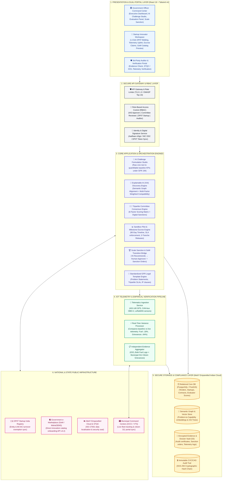

# 🏛️ MahaStartup: System Architecture & Technical Specification
> **Smart India Hackathon (SIH 2026)** | Problem Statement ID: `26136`  
> **System**: **MahaStartup • Innovation Procurement Command Center**

---

## 📐 1. Master System Architecture Diagram (Mermaid)



---

## 🏛️ 2. Architectural Layer-by-Layer Deep Dive

### Layer 1: Presentation & Dual-Portal Layer
- **Tech Stack**: React 18, TypeScript, Tailwind CSS v4, Plus Jakarta Sans, Lucide React, Canvas Confetti.
- **Components**:
  - **Government Officer Portal**: High-level Executive Dashboard, 7-stage visual pipeline funnel, AI Challenge Builder, 6-factor evaluation scoring sheet, live pilot monitor, GeM Scale Decision, and CVC audit viewer.
  - **Startup Innovator Portal**: 1-click DPIIT bidding feed, active pilot telemetry dashboard, milestone escrow claim uploader, and XAI match profile.
  - **Auditor Portal**: Independent certificate and telemetry verification.

---

### Layer 2: Secure API Gateway & Identity Management
- **Role-Based Access Control (RBAC)**:
  - `GOVT_OFFICER_APPROVER` (IAS / Joint Secretary — full sanction authority)
  - `COMMITTEE_EVALUATOR` (IIT Professor / Department Head — scoring permissions)
  - `STARTUP_ADMIN` (DPIIT Entity — bid submission, escrow claims, telemetry uplink)
  - `INDEPENDENT_AUDITOR` (IOCL / STQC / PwC — evidence verification)
- **Security Standards**: TLS 1.3 end-to-end encryption, digital signature (DSC) validation, and JWT session handling.

---

### Layer 3: Core Application & Orchestration Services
1. **AI Challenge Formulation Service**: Ingests unstructured problem complaints and applies NLP to construct standardized outcome-based problem statements with quantifiable KPI baselines under GFR Rule 194.
2. **Explainable AI (XAI) Matching Engine**: Performs semantic graph alignment between municipal challenges and DPIIT startup capabilities, outputting multi-factor weighted match scores (0–100%) and concept trees.
3. **Tripartite Consensus Engine**: Gathers multi-member scoring across 6 dimensions and automatically computes weighted consensus benchmarks.
4. **Sandbox Pilot & Milestone Escrow Manager**: Enforces 90-day sandbox pilot SLAs and triggers 3-tranche milestone budget disbursements (30% $\rightarrow$ 40% $\rightarrow$ 30%).
5. **Scale Decision & GeM Transition Bridge**: Validates the *Ready to Scale* threshold ($\ge 85/100$) and compiles official printable Sanction Orders (`MAHA-STARTUP-2026/PUNE-SWM-088`).
6. **Standardized Template Manager**: Serves pre-vetted legal agreements, GFR 194 guidelines, and 100% startup IP protection clauses.

---

### Layer 4: Telemetry & Empirical Verification Pipeline
- **IoT Ingestion Stream**: Ingests vehicle GPS (AIS-140), OBD-II CAN-bus diagnostic logs (engine idle time, diesel burn rate), and bin sensor fill levels.
- **Variance Processor**: Automatically compares live incoming telemetry against original baselines:
  $$\text{Fuel Variance} = \frac{\text{Current (82 L/day)} - \text{Baseline (100 L/day)}}{\text{Baseline (100 L/day)}} = -18.2\% \quad (\text{Target: } \le -15\%)$$
- **Evidence Verification Connector**: Links third-party verification receipts (IOCL fleet cards, PMC 311 citizen grievance logs) to pilot milestone records.

---

### Layer 5: Secure Storage & Compliance Layer (MeitY Indian Cloud)
- **Relational DB (PostgreSQL + PostGIS)**: Stores structured tenders, bids, evaluation scores, contracts, and municipal GIS boundary polylines.
- **Semantic Vector & Graph Store**: Stores problem-to-capability embeddings and semantic graph relationships.
- **Encrypted Document Vault**: S3-compatible encrypted storage (AES-256) for audit certificates, sanction orders, and telemetry dumps.
- **Immutable CVC/CAG Audit Trail**: Cryptographic SHA-256 ledger chaining all officer decisions and milestone verifications.

---

### Layer 6: External Ecosystem Integrations
- **Startup India (DPIIT)**: Validates recognition numbers (`DIPP-89421-IN`) and verifies 80-IAC tax/turnover exemption status.
- **Government e-Marketplace (GeM / MahaGEMS)**: API v4.2 bridge for direct custom category onboarding without fresh tender floating.
- **MeitY STQC Directorate**: ISO 27001 data localisation and zero-vulnerability certification compliance.
- **Municipal Command Centers (ICCC / VTS)**: Ingests smart city telemetry and citizen 311 portal grievance feeds.

---

## 🔄 3. End-to-End Data Flow Sequence

```text
[Citizen Problem] 
       │
       ▼
1. AI Challenge Studio ──────────► Generates MAHA-2026-014 (Baseline KPIs: Fuel ↓15%, Grievances ↓50%)
       │
       ▼
2. XAI Semantic Matcher ────────► Matches RouteAI Technologies (92% Fit, Low Risk)
       │
       ▼
3. Expert Committee Matrix ──────► 3-Member Panel Awards 90.0/100 Score & Sanctions ₹8.20L Sandbox Pilot
       │
       ▼
4. Sandbox Pilot Field Deploy ───► 24 Trucks in Pune Wards 4, 7, 9 stream OBD-II / GPS Telemetry
       │
       ▼
5. Telemetry Variance Engine ────► Verifies Fuel ↓18.2%, Pickups ↓64.2% (IOCL & 311 Audited)
       │
       ▼
6. Milestone Escrow Release ─────► Treasury disburses Tranche 1 & 2 (₹5.12L) within 48 hours
       │
       ▼
7. Scale Sanction Authorization ─► Joint Secretary digitally signs Sanction Order for ₹3.80 Cr GeM Rollout
```

---

## 🛡️ 4. Security & Regulatory Compliance Matrix

| Security / Governance Aspect | Standard Enforced in MahaStartup |
| :--- | :--- |
| **Legal Procurement Basis** | GFR 2017 Rule 194 (Procurement of Innovation & Sandbox Testing) |
| **Eligibility Exemption** | Startup India / DPIIT Notification (Exemption from 3-yr turnover & experience) |
| **Data Localisation** | 100% Stored in MeitY-Empanelled India Data Centers (NIC / AWS Mumbai) |
| **Encryption Standards** | AES-256 for Data-at-Rest • TLS 1.3 for Data-in-Transit |
| **Audit Transparency** | Immutable SHA-256 Hash Chain compliant with CVC & CAG guidelines |
| **Intellectual Property** | 100% Startup Background IP & Source Code Ownership Protection |
